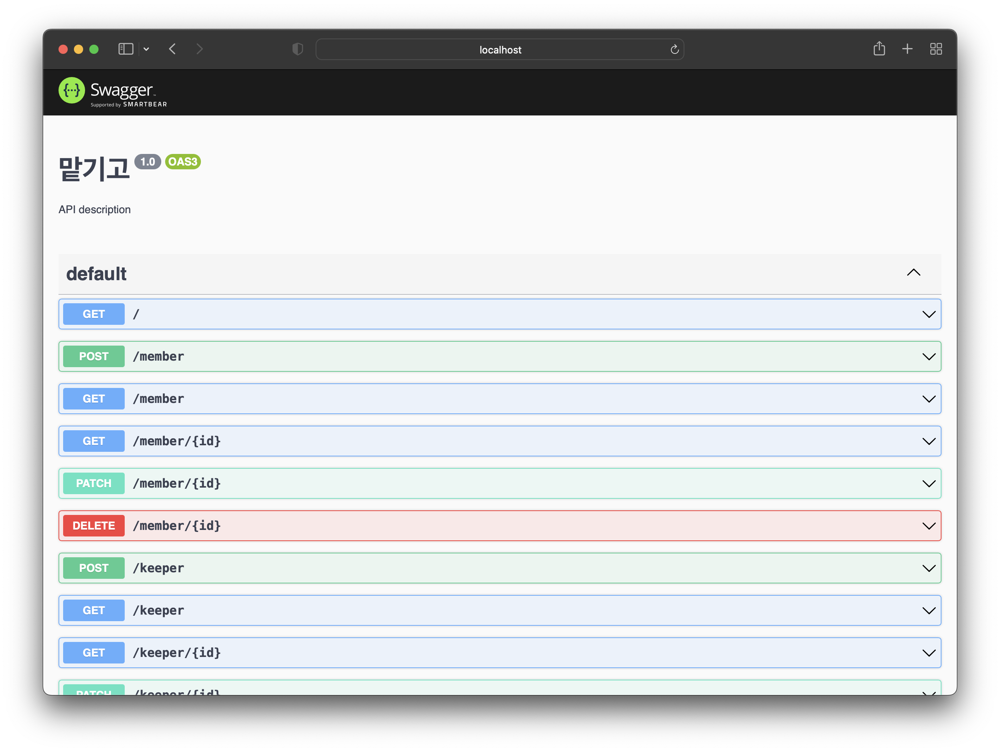

## Running the app

```bash
# development
$ yarn start

# watch mode
$ yarn start:dev

# production mode
$ yarn start:prod
```

## Test

```bash
# unit tests
$ yarn test

# e2e tests
$ yarn test:e2e

# test coverage
$ yarn test:cov
```

https://kepelrs.github.io/nestjs-prisma-crud/access-control-module/builtin-policies

## DB

```
$ yarn prisma generate
$ yarn prisma migrate dev  
$ yarn prisma db seed  
```

## DB erd 생성

```
$ yarn add -D prisma-erd-generator @mermaid-js/mermaid-cli
$ yarn prisma generate
```


## curd 탬플릿 생성

```
$ nest g -c nestjs-prisma-crud-schematics crud-resource resouseName
```

## api 명세서 swagger 

http://localhost:3000/api



